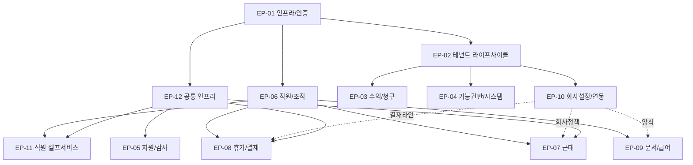

# 의존성 그래프

> Epic / Story / Task 간 선행 관계. Phase 6 스프린트 순서 결정의 근거.

## Epic 의존성

## 진입 순서 권장 (Sprint 1~6 MVP P0)

| Sprint | 핵심 Epic 진입 | 핵심 Story | 결과물 |
|--------|--------------|----------|--------|
| 1 | EP-01 (전체) + EP-12 일부 (Realtime/감사) | ST-001~005 + ST-068/069 | 로그인/2FA/RLS + audit_logs |
| 2 | EP-02 (전체) + EP-10 (ST-053/054 회사설정/결재라인) | ST-006~010 + ST-053/054 | 신규 테넌트 온보딩 가능 |
| 3 | EP-06 (전체) + EP-12 (CM-09/10/11/12 파일/Excel) | ST-024~030 + ST-063/064 | 직원 마스터 + 조직도 |
| 4 | EP-07 (전체) + EP-11 (ST-058 대시보드) | ST-031~036 + ST-058 | 출퇴근 PWA + 회사 모니터링 |
| 5 | EP-08 일부 (휴가 본류) | ST-037~040, ST-046 | 휴가 신청 + 승인 + 잔여 |
| 6 | EP-08 나머지 + EP-11 (전체) + EP-12 (알림 채널) | ST-041~045, ST-059~062 + ST-066 | 결재 인박스 + 직원 셀프서비스 + 알림 폴백 |

→ **MVP P0 출시 가능 (베타 후보 1차)**

## Sprint 7~10 (MVP P1)

| Sprint | Epic | 결과물 |
|--------|------|--------|
| 7 | EP-09 (문서/급여) | 급여명세서 일괄 + 증명서 + 계약서 |
| 8 | EP-03 (수익/청구) | 청구 일괄 + 미납 추적 + 리포트 |
| 9 | EP-04 (기능권한/시스템) + EP-05 (지원/감사) | OP-07/08/09/11 |
| 10 | EP-10 나머지 (외부 연동/리포트 △) + 폴리싱 | 카카오/SMS/API/리포트 |

→ **MVP 완전체 출시**

## Story 레벨 핵심 의존 (Sprint 1~6)

### Sprint 1 (Foundation)
- ST-001 ← (없음)
- ST-002~004 ← ST-001
- ST-005 ← ST-001, ST-068 동시
- ST-068/069 ← Supabase 인프라

### Sprint 2 (Tenant)
- ST-006 ← ST-005 (RLS), ST-053 (초기 데이터 입력 폼)
- ST-007~010 ← ST-006
- ST-053/054 ← ST-005

### Sprint 3 (Employees)
- ST-024~027 ← ST-006 (테넌트 존재), ST-005 (RLS)
- ST-028~029 ← ST-006 (회사 단위 트리)
- ST-030 ← ST-024

### Sprint 4 (Attendance)
- ST-031 ← ST-024 (직원), ST-053 (work_policy)
- ST-032~036 ← ST-031

### Sprint 5 (Leave 본류)
- ST-037 ← ST-053 (leave_types), ST-054 (approval_lines), ST-024 (employee)
- ST-038~040 ← ST-037
- ST-046 ← ST-054

### Sprint 6 (Approvals 통합 + Employee Self)
- ST-041~042 ← ST-037, EP-07 Approval 흐름
- ST-058 ← 모든 P0 Epic
- ST-059~062 ← EP-06
- ST-066 ← ST-068, ST-055 (카카오 연동)

## Cross-Epic 동시 진행 가능 페어

- EP-01 + EP-12 (인프라 동시): RLS + audit + Realtime 동시 셋업
- EP-02 + EP-10 일부 (회사 설정): 마법사 6단계가 회사 설정 양식 입력
- EP-06 + EP-12 (CM-09~12): 직원 일괄 업로드는 Excel 인프라 의존
- EP-07 + EP-11 (대시보드): 출퇴근 카드가 EM-01 대시보드 일부

## 외부 의존 (블로커 후보)

| 외부 | 영향 Story | 진입 권장 시점 |
|------|----------|-------------|
| NHN Cloud 알림톡 채널 인증 | ST-055, ST-066 | Sprint 1 시작 시 신청 (NHN Cloud 가이드: 사업자 정보 검토 + 카카오 비즈 메시지 채널 심사 → 일반적으로 영업일 2~6주, 즉 14~42일. 보수적으로 60일 가정) |
| Supabase 프로젝트 + Pro 플랜 | 모두 | Sprint 1 |
| Vercel 프로젝트 | 모두 | Sprint 1 |
| Sentry 프로젝트 | Sprint 7 이후 (운영 단계) | Sprint 6 말 |
| Tauri 코드 서명 인증서 | Tauri 데스크톱 배포 | Sprint 9 |
| 사업자등록 + 정보통신 신고 | 베타 진입 전 | Sprint 7 시작 |

## 변경 이력

| 일자 | 변경 | 사유 |
|------|------|------|
| 2026-05-15 | 초안 — 12 Epic / Sprint 1~10 / 외부 의존 | Phase 2 진입 |
