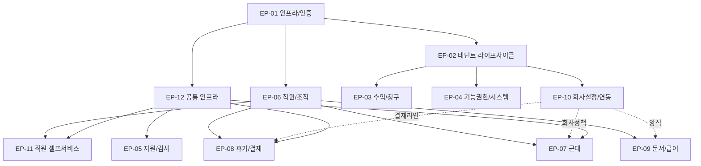
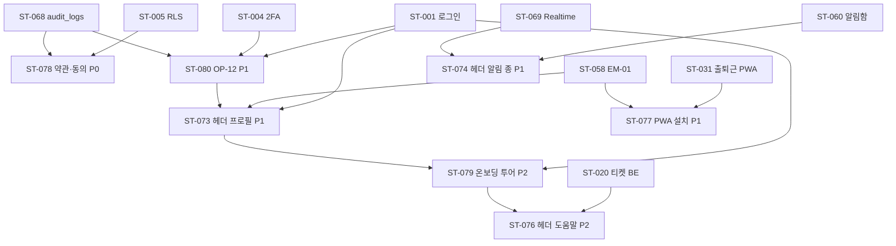

# 의존성 그래프

> Epic / Story / Task 간 선행 관계. Phase 6 스프린트 순서 결정의 근거.

## Epic 의존성

## 진입 순서 권장 (Sprint 1~6 MVP P0)

| Sprint | 핵심 Epic 진입 | 핵심 Story | 결과물 |
|--------|--------------|----------|--------|
| 1 | EP-01 (전체) + EP-12 (audit/Realtime/CM-06 오류/CM-21 약관) | ST-001~005 + ST-068/069 + ST-072 + ST-078 | 로그인/2FA/RLS + audit_logs + Realtime + 오류 페이지 + PIPA 약관 동의 |
| 2 | EP-02 (전체) + EP-10 (ST-053/054 회사설정/결재라인) | ST-006~010 + ST-053/054 | 신규 테넌트 온보딩 가능 |
| 3 | EP-06 (전체 + ST-071 관리자 대시보드) + EP-12 (CM-09~13 파일/Excel/PDF) | ST-024~030 + ST-071 + ST-063/064/065 | 직원 마스터 + 조직도 + 관리자 대시보드 + 공통 파일/Excel/PDF 인프라 |
| 4 | EP-07 (전체) + EP-12 보강 (ST-077 PWA 설치 가이드) | ST-031~036 + ST-077 | 출퇴근 PWA + 회사 모니터링 + PWA 설치 안내 |
| 5 | EP-08 일부 (휴가 본류) | ST-037~040, ST-046 | 휴가 신청 + 승인 + 잔여 |
| 6 | EP-08 나머지 + EP-11 (전체) + EP-12 (알림 채널) + EP-03 ST-070 (P0 placeholder) | ST-041~045 + ST-058~060 + ST-062 + ST-066 + ST-070 | 결재 인박스 + 직원 셀프서비스 + 알림 폴백 + 운영사 대시보드 placeholder |

→ **MVP P0 출시 가능 (베타 후보 1차)** — 본 표는 mvp-plan §4 SSOT와 정확 정합 (2026-05-19 codex P1 정정).

## Sprint 7~10 (MVP P1)

| Sprint | Epic | 결과물 |
|--------|------|--------|
| 7 | EP-09 (문서/급여) | 급여명세서 일괄 + 증명서 + 계약서 |
| 8 | EP-03 (수익/청구) | 청구 일괄 + 미납 추적 + 리포트 |
| 9 | EP-04 (기능권한/시스템) + EP-05 (지원/감사) | OP-07/08/09/11 |
| 10 | EP-10 나머지 (외부 연동/리포트 △) + 폴리싱 | 카카오/SMS/API/리포트 |

→ **MVP 완전체 출시**

## Story 레벨 핵심 의존 (Sprint 1~6)

### Sprint 1 (Foundation)
- ST-001 ← (없음)
- ST-002~004 ← ST-001
- ST-005 ← ST-001, ST-068 동시
- ST-068/069 ← Supabase 인프라
- ST-072 (CM-06 오류·점검 P0) ← ST-005 (RLS), ST-068 (audit_logs), Sentry 인프라

### Sprint 2 (Tenant)
- ST-006 ← ST-005 (RLS), ST-053 (초기 데이터 입력 폼)
- ST-007~010 ← ST-006
- ST-053/054 ← ST-005

### Sprint 3 (Employees)
- ST-024~027 ← ST-006 (테넌트 존재), ST-005 (RLS)
- ST-028~029 ← ST-006 (회사 단위 트리)
- ST-030 ← ST-024
- ST-071 (TA-01 관리자 대시보드 P0) ← ST-024 (직원 마스터), ST-068 (audit), ST-069 (Realtime) — 직원 마스터 완료 직후 진입, 차트 데이터는 EP-07/08 진행 따라 점진적 활성

### Sprint 4 (Attendance)
- ST-031 ← ST-024 (직원), ST-053 (work_policy)
- ST-032~036 ← ST-031

### Sprint 5 (Leave 본류)
- ST-037 ← ST-053 (leave_types), ST-054 (approval_lines), ST-024 (employee)
- ST-038~040 ← ST-037
- ST-046 ← ST-054

### Sprint 6 (Approvals 통합 + Employee Self)
- ST-041~042 ← ST-037, EP-07 Approval 흐름
- ST-058 ← 모든 P0 Epic
- ST-059~062 ← EP-06
- ST-066 ← ST-068, ST-055 (NHN — S1 day 1 신청 → S6 ST-066 진입 시점 D+71에 60일 보수 일정 + 11일 마진 충분)
- ST-070 ← ST-007 (S2 활성), ST-068/069 (S1 인프라). **placeholder**: ST-011~014 (S8) + ST-020~022 (S9) 데이터 의존이지만 화면+API 자체는 P0 MVP 출시 요구로 S6 가동. S8/S9 데이터 자동 연결 (sprint-006.md ST-070 행 참조). 본 절은 Phase 6 mvp-plan §4 ST-070 S6 placeholder 결정 반영 (2026-05-19).

### Sprint 8 (P1 운영사 도메인)
- ST-070 (OP-01 운영사 대시보드 P0) — 화면+API는 S6 placeholder 가동 (위 §Sprint 6 참조). S8 시점에 ST-011~014 (청구/플랜) + ST-020~022 (티켓/감사) 데이터 활성 → ST-070 실제 데이터 자동 연결 (사용자 가시 변경 0, 데이터 backend wiring만)

## ST-073~080 신규 8 Story 의존 (KI-027~030 batch-003 보강)

> PRD 보강 (CM-16~22 + OP-12) 대응 8 Story의 선행 관계. 본 절은 Sprint 1~6 본문 표와 함께 KI-034 closure 2026-05-19 추가.

| Story | 화면 | 우선순위 | 선행 | 진입 권장 Sprint |
|-------|------|--------|------|----------------|
| ST-073 | CM-16 헤더 프로필 드롭다운 | P1 | ST-001 (로그인), ST-058~062 (직원 셀프), ST-080 (OP-12) | Sprint 7 (헤더 컴포넌트 일괄) |
| ST-074 | CM-17 헤더 알림 종 | P1 | ST-060 (알림함), ST-069 (Realtime publication) | Sprint 7 |
| ST-075 | CM-18 헤더 검색 안내 | P3 | (없음 — FE only) | Sprint 10 (잔여 폴리싱) |
| ST-076 | CM-19 헤더 도움말 | P2 | ST-020 (티켓 BE), ST-079 (CM-22 투어 재실행) | Sprint 9 |
| ST-077 | CM-20 PWA 설치 가이드 | P1 | ST-031 (출퇴근 PWA), ST-058 (EM-01 PWA) | Sprint 4 (PWA 묶음) 또는 Sprint 7 |
| ST-078 | CM-21 약관/개인정보 + 동의 | P0 | ST-005 (RLS), ST-068 (audit_logs) | Sprint 1 (PIPA 컴플라이언스 — MVP 출시 의무) |
| ST-079 | CM-22 첫 로그인 온보딩 투어 | P2 | ST-001 (로그인), ST-073 (헤더 프로필 — 다시 보기 진입) | Sprint 9 |
| ST-080 | OP-12 운영사 본인 프로필 | P1 | ST-001 (로그인), ST-004 (2FA), ST-068 (audit) | Sprint 8 (운영사 묶음 EP-03 동시) |

### Mermaid (신규 8 Story)

### Sprint 진입 권장 요약

- **Sprint 1**: ST-078 동시 진행 (PIPA 컴플라이언스 — DB 마이그레이션 + 강제 동의 가드는 인증과 함께)
- **Sprint 4 또는 7**: ST-077 (PWA 설치 가이드 — EM-02 출퇴근 묶음 또는 헤더 컴포넌트 묶음)
- **Sprint 7**: ST-073/074 (헤더 프로필 + 알림 종 — UI 컴포넌트 일괄)
- **Sprint 8**: ST-080 (OP-12 운영사 프로필 — EP-03 운영사 도메인 동시)
- **Sprint 9**: ST-076/079 (도움말 패널 + 온보딩 투어)
- **Sprint 10**: ST-075 (검색 안내 — 잔여 폴리싱)

---

## Cross-Epic 동시 진행 가능 페어

- EP-01 + EP-12 (인프라 동시): RLS + audit + Realtime 동시 셋업
- EP-02 + EP-10 일부 (회사 설정): 마법사 6단계가 회사 설정 양식 입력
- EP-06 + EP-12 (CM-09~12): 직원 일괄 업로드는 Excel 인프라 의존
- EP-07 + EP-11 (대시보드): 출퇴근 카드가 EM-01 대시보드 일부

## 외부 의존 (블로커 후보)

| 외부 | 영향 Story | 진입 권장 시점 |
|------|----------|-------------|
| NHN Cloud 알림톡 채널 인증 | ST-055, ST-066 | Sprint 1 시작 시 신청 (NHN Cloud 가이드: 사업자 정보 검토 + 카카오 비즈 메시지 채널 심사 → 일반적으로 영업일 2~6주, 즉 14~42일. 보수적으로 60일 가정) |
| Supabase 프로젝트 + Pro 플랜 | 모두 | Sprint 1 |
| Vercel 프로젝트 | 모두 | Sprint 1 |
| Sentry 프로젝트 | Sprint 7 이후 (운영 단계) | Sprint 6 말 |
| Tauri 코드 서명 인증서 | Tauri 데스크톱 배포 | Sprint 9 |
| 사업자등록 + 정보통신 신고 | 베타 진입 전 | Sprint 7 시작 |

## 변경 이력

| 일자 | 변경 | 사유 |
|------|------|------|
| 2026-05-15 | 초안 — 12 Epic / Sprint 1~10 / 외부 의존 | Phase 2 진입 |
| 2026-05-19 | ST-073~080 신규 8 Story 의존 절 추가 (선행 + Sprint 진입 권장 + Mermaid) | KI-034 closure (Phase 6 진입 전 의무) |
