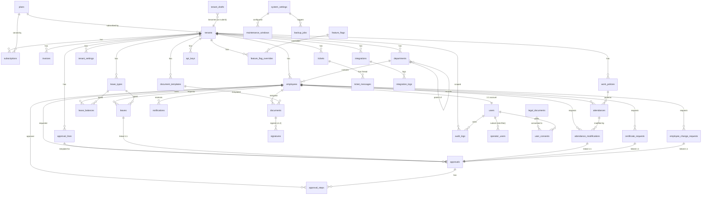
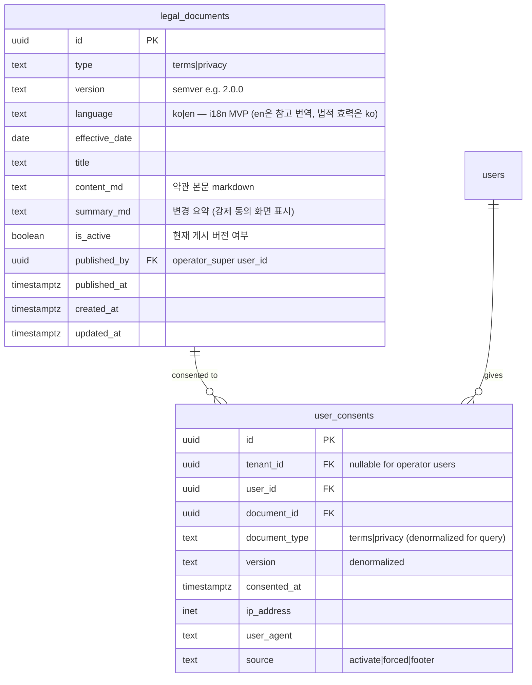

# 전체 ERD (Mermaid)

> 39 엔티티 × Postgres 스키마. 도메인별 4분할 + 통합 그래프.
> 2026-05-15 (KI-030 batch-003): legal_documents, user_consents 추가.

## 1. 통합 ERD (핵심 관계)



> 위 그래프는 외래키 관계만 표시. 권한·RLS는 `rls.md` 참조.

## 2. 운영사 도메인 ERD (13 엔티티)

```mermaid
erDiagram
    plans {
        uuid id PK
        text slug UK
        text name
        int base_price_krw
        int per_user_price_krw
        int included_users
        text[] modules
        enum status "active|inactive|sales_stopped|custom"
        boolean is_public
        int sort_order
        timestamptz created_at
        timestamptz updated_at
    }

    tenants {
        uuid id PK
        text name
        text business_number UK
        text slug UK "subdomain"
        text representative_name
        text industry
        text address
        text phone
        uuid plan_id FK
        enum status "active|inactive|overdue|expiring_soon|expired|archived"
        date contract_start_date
        date contract_end_date
        int user_limit
        int active_user_count "denorm cache"
        uuid admin_user_id FK
        text logo_url
        jsonb metadata
        timestamptz created_at
        timestamptz updated_at
        timestamptz deleted_at "soft"
    }

    tenant_drafts {
        uuid id PK
        uuid created_by FK "operator user"
        int current_step "1~7"
        jsonb form_data "단계별 입력"
        timestamptz created_at
        timestamptz updated_at
    }

    subscriptions {
        uuid id PK
        uuid tenant_id FK
        uuid plan_id FK
        int latched_price_per_user "변경 시 기존 구독 보존"
        int latched_base_price
        date period_start
        date period_end
        enum billing_cycle "monthly|annual"
        timestamptz created_at
        timestamptz updated_at
    }

    invoices {
        uuid id PK
        uuid tenant_id FK
        uuid subscription_id FK
        text invoice_number UK "INV-YYYYMM-NNNN"
        date period_month
        int active_users
        bigint subtotal_krw
        bigint tax_krw
        bigint total_krw
        enum status "draft|issued|paid|overdue|failed|refunded"
        date issued_at
        date due_date
        date paid_at
        text payment_method
        text tax_invoice_id
        timestamptz created_at
        timestamptz updated_at
    }

    feature_flags {
        text key PK "snake_case"
        text label_ko
        text description
        text module
        enum global_state "active|inactive|beta|restricted"
        uuid[] plan_ids "제공 플랜"
        boolean is_beta
        timestamptz applied_at
        timestamptz created_at
        timestamptz updated_at
    }

    feature_flag_overrides {
        text flag_key PK
        uuid tenant_id PK
        boolean value "true=강제ON, false=강제OFF"
        uuid created_by FK
        text reason
        timestamptz created_at
    }

    tickets {
        uuid id PK
        uuid tenant_id FK "nullable for cross-tenant by operator"
        text ticket_number UK "TK-YYYY-NNNNN"
        text title
        enum type "inquiry|incident|request|other"
        enum priority "p0|p1|p2|p3"
        enum status "open|in_progress|waiting_user|resolved|closed"
        uuid assigned_to FK
        uuid requester_id FK
        timestamptz sla_deadline
        timestamptz created_at
        timestamptz updated_at
    }

    ticket_messages {
        uuid id PK
        uuid ticket_id FK
        uuid author_id FK
        text body
        boolean is_internal "내부 메모"
        uuid[] attachment_ids
        timestamptz created_at
    }

    system_settings {
        uuid id PK "singleton, only 1 row"
        text brand_name "운영사 브랜드명 (default 'FlowHR')"
        text brand_logo_url "운영사 로고 이미지 URL (Storage)"
        text brand_logo_url_dark "운영사 로고 — 사이드바(다크 배경)용"
        jsonb password_policy
        jsonb session_policy
        boolean require_operator_2fa
        jsonb mail_config
        jsonb notification_channels
        jsonb data_retention
        timestamptz created_at
        timestamptz updated_at
    }

    maintenance_windows {
        uuid id PK
        enum status "inactive|scheduled|active"
        text message_ko
        timestamptz scheduled_start
        timestamptz scheduled_end
        timestamptz activated_at
        timestamptz deactivated_at
        uuid created_by FK
    }

    backup_jobs {
        uuid id PK
        enum status "pending|running|success|failed"
        enum kind "auto|manual"
        text storage_url "S3 / Supabase Storage"
        bigint size_bytes
        text error_message
        timestamptz started_at
        timestamptz finished_at
        uuid triggered_by FK "null if cron"
    }

    operator_users {
        uuid user_id PK FK
        enum role "operator_super|operator_staff"
        boolean is_active
        timestamptz invited_at
        timestamptz activated_at
    }

    plans ||--o{ subscriptions : ""
    plans ||--o{ tenants : ""
    tenants ||--o{ subscriptions : ""
    tenants ||--o{ invoices : ""
    tenants ||--o{ tickets : ""
    tenants ||--o{ feature_flag_overrides : ""
    subscriptions ||--o{ invoices : ""
    feature_flags ||--o{ feature_flag_overrides : ""
    tickets ||--o{ ticket_messages : ""
```

## 3. HR 도메인 ERD (17 엔티티)

```mermaid
erDiagram
    departments {
        uuid id PK
        uuid tenant_id FK
        uuid parent_id FK "nullable, self-ref"
        text name
        text code UK "회사 내 부서 코드"
        uuid head_employee_id FK
        boolean is_active
        text description
        text path_cache "자식 경로 캐시 (선택)"
        int sort_order
        timestamptz created_at
        timestamptz updated_at
    }

    employees {
        uuid id PK
        uuid tenant_id FK
        text employee_number UK "사번, 회사 내 unique"
        uuid user_id FK "1:1 with auth.users"
        text name
        text email UK
        text phone
        uuid department_id FK
        text position "직급"
        text job_title "직책"
        enum employment_type "regular|contract|part_time|freelancer"
        enum status "invited|probation|active|on_leave|resigned|inactive"
        date joined_at
        date probation_ends_at
        date left_at
        date birth_date
        text bank_account_encrypted "pgcrypto"
        jsonb address
        jsonb emergency_contact
        jsonb family_info
        text avatar_url
        text role "tenant_super|tenant_hr_admin|tenant_manager|employee"
        timestamptz created_at
        timestamptz updated_at
        timestamptz deleted_at
    }

    users {
        uuid id PK "= auth.users.id"
        uuid employee_id FK "nullable for operator users"
        uuid tenant_id "denorm for RLS"
        text role
        boolean totp_enabled
        text totp_secret_encrypted
        text[] recovery_codes_hash
        timestamptz last_login_at
        text last_login_ip
        timestamptz created_at
        timestamptz updated_at
    }

    roles {
        text key PK "operator_super|...|employee"
        text label_ko
        jsonb default_permissions
        boolean is_system "tenant_super 등은 system, 커스텀은 false"
    }

    attendances {
        uuid id PK
        uuid tenant_id FK
        uuid employee_id FK
        date work_date
        timestamptz clock_in_at
        timestamptz clock_out_at
        int break_minutes "default 0"
        enum work_type "office|remote|outside|business_trip"
        enum status "normal|late|early_leave|absent|leave|remote|outside|business_trip|missing|modification_pending|modification_done"
        point clock_in_location "PostGIS or jsonb {lat,lng}"
        point clock_out_location
        text device_id
        uuid modified_by FK "nullable"
        text modification_reason
        int work_minutes "계산값"
        timestamptz created_at
        timestamptz updated_at
    }

    attendance_modifications {
        uuid id PK
        uuid tenant_id FK
        uuid employee_id FK
        uuid attendance_id FK "nullable, 누락 케이스는 신규 생성"
        date target_date
        enum request_type "clock_in|clock_out|break|outside"
        timestamptz original_value
        timestamptz requested_value
        text reason
        uuid[] attachment_ids
        uuid approval_id FK "1:1 with approvals"
        enum status "pending|in_progress|approved|rejected|cancelled"
        timestamptz created_at
        timestamptz updated_at
    }

    leave_types {
        uuid id PK
        uuid tenant_id FK
        text key "annual|sick|family|maternity|..."
        text label_ko
        int default_days "신규 부여 기본"
        boolean evidence_required
        boolean carryover_allowed
        boolean is_paid
        int sort_order
        timestamptz created_at
        timestamptz updated_at
    }

    leaves {
        uuid id PK
        uuid tenant_id FK
        uuid employee_id FK
        uuid leave_type_id FK
        date start_date
        date end_date
        enum half_day "none|start|end"
        numeric used_days "0.5 단위"
        text reason
        uuid substitute_employee_id FK
        uuid[] attachment_ids
        uuid approval_id FK "1:1"
        enum status "draft|pending|in_progress|approved|rejected|cancelled|completed"
        timestamptz requested_at
        timestamptz completed_at
        timestamptz created_at
        timestamptz updated_at
    }

    leave_balances {
        uuid id PK
        uuid tenant_id FK
        uuid employee_id FK
        uuid leave_type_id FK
        int year "회계연도"
        numeric granted "총 부여"
        numeric used
        numeric scheduled "승인 완료, 미사용"
        numeric remaining "= granted - used - scheduled"
        date expires_at
        timestamptz created_at
        timestamptz updated_at
    }

    approval_lines {
        uuid id PK
        uuid tenant_id FK
        text name
        enum request_type "leave|attendance_mod|certificate|change_request|document"
        jsonb conditions "[{field:'leave_days', op:'>=', value:5, line:[steps...]}]"
        jsonb default_line "[{order:1, approver_role:'manager', dept_scope:'own_team'}]"
        boolean is_active
        timestamptz created_at
        timestamptz updated_at
    }

    approvals {
        uuid id PK
        uuid tenant_id FK
        uuid requester_id FK
        text request_type "leave|attendance_mod|certificate|change_request|document"
        uuid request_object_id "FK to leaves/attendance_mods/...; nullable polymorphic"
        text title "auto-generated"
        enum status "draft|pending|in_progress|approved|rejected|cancelled"
        int current_step
        int total_steps
        timestamptz sla_deadline
        timestamptz requested_at
        timestamptz completed_at
        timestamptz created_at
        timestamptz updated_at
    }

    approval_steps {
        uuid id PK
        uuid tenant_id FK
        uuid approval_id FK
        int step_order
        uuid approver_id FK
        enum status "pending|approved|rejected|skipped|delegated"
        text comment
        timestamptz processed_at
        timestamptz created_at
        timestamptz updated_at
    }

    documents {
        uuid id PK
        uuid tenant_id FK
        uuid owner_id FK "employee or null for company-wide"
        enum sub_type "payslip|contract|certificate|personal|company"
        text title
        text file_url
        text mime_type
        bigint file_size_bytes
        uuid template_id FK
        jsonb metadata "지급월/지급액 등"
        enum status "draft|created|sent|viewed|acknowledged|expired"
        enum visibility "owner_only|owner_and_hr|company_wide"
        timestamptz sent_at
        timestamptz viewed_at
        timestamptz acknowledged_at
        date expires_at
        uuid created_by FK
        timestamptz created_at
        timestamptz updated_at
        timestamptz deleted_at
    }

    certificate_requests {
        uuid id PK
        uuid tenant_id FK
        uuid employee_id FK
        text certificate_type "employment|career|resignation|tax_withholding"
        text submission_target
        text purpose
        int copies
        text delivery_method "email|in_app|postal|in_person"
        text request_memo
        uuid approval_id FK "1:1"
        uuid issued_document_id FK "nullable until issued"
        enum status "pending|in_progress|issued|rejected|cancelled"
        timestamptz issued_at
        timestamptz created_at
        timestamptz updated_at
    }

    notifications {
        uuid id PK
        uuid tenant_id FK
        uuid user_id FK
        enum type "approval|document|system|announcement"
        text title
        text message
        text link_url
        jsonb metadata
        boolean read_status
        timestamptz read_at
        timestamptz created_at
    }

    audit_logs {
        uuid id PK
        uuid tenant_id "nullable for cross-tenant operator actions"
        uuid actor_id FK
        text actor_role
        text action "tenant.create|employee.update|leave.approve|..."
        text target_type
        uuid target_id
        jsonb before
        jsonb after
        text ip
        text user_agent
        text request_id
        enum result "success|failed|denied"
        timestamptz created_at
    }

    employee_change_requests {
        uuid id PK
        uuid tenant_id FK
        uuid employee_id FK
        text field_name "name|bank_account|family_info|..."
        jsonb old_value
        jsonb new_value
        text reason
        uuid approval_id FK "1:1"
        enum status "pending|approved|rejected|cancelled"
        timestamptz created_at
        timestamptz updated_at
    }

    departments ||--o{ departments : ""
    departments ||--o{ employees : ""
    employees ||--|| users : ""
    employees ||--o{ attendances : ""
    employees ||--o{ attendance_modifications : ""
    employees ||--o{ leaves : ""
    employees ||--o{ leave_balances : ""
    employees ||--o{ approvals : ""
    employees ||--o{ approval_steps : ""
    employees ||--o{ documents : ""
    employees ||--o{ certificate_requests : ""
    employees ||--o{ notifications : ""
    employees ||--o{ employee_change_requests : ""
    leave_types ||--o{ leaves : ""
    leave_types ||--o{ leave_balances : ""
    approval_lines ||--o{ approvals : ""
    approvals ||--o{ approval_steps : ""
    approvals ||--|| leaves : ""
    approvals ||--|| attendance_modifications : ""
    approvals ||--|| certificate_requests : ""
    approvals ||--|| employee_change_requests : ""
    attendances ||--o{ attendance_modifications : ""
```



## 4. 회사 설정 / 연동 / v1.2 슬롯 ERD (7 엔티티)

```mermaid
erDiagram
    tenant_settings {
        uuid id PK
        uuid tenant_id FK UK
        jsonb company_info
        jsonb security_policy "비밀번호/세션/2FA"
        jsonb notification_config
        timestamptz created_at
        timestamptz updated_at
    }

    work_policies {
        uuid id PK
        uuid tenant_id FK
        text name "기본 / 시차 / 유연 / 재택"
        time standard_clock_in "09:00"
        time standard_clock_out "18:00"
        time late_threshold "09:01"
        int break_minutes_default
        int weekly_max_hours "주 52"
        text[] applicable_departments
        boolean is_default
        date applied_from
        timestamptz created_at
        timestamptz updated_at
    }

    document_templates {
        uuid id PK
        uuid tenant_id FK
        text key "labor_contract|employment_cert|..."
        text label_ko
        text template_body "with {{variables}}"
        text[] variables
        text template_format "pdf|hwp|docx"
        timestamptz created_at
        timestamptz updated_at
    }

    integrations {
        uuid id PK
        uuid tenant_id FK
        text type "kakao_alimtalk|sms|smtp|slack|sso_saml|webhook|..."
        enum status "disconnected|connected|error|expired"
        jsonb credentials_encrypted "NHN Cloud key, SMTP password 등"
        jsonb config "channel id, sender etc"
        timestamptz last_synced_at
        int failure_count_24h
        timestamptz created_at
        timestamptz updated_at
    }

    integration_logs {
        uuid id PK
        uuid tenant_id FK
        uuid integration_id FK
        text event_type "send|webhook_in|sync"
        jsonb request_payload
        jsonb response_payload
        int http_status
        text error_message
        timestamptz created_at
    }

    api_keys {
        uuid id PK
        uuid tenant_id FK "nullable for operator keys"
        text key_hash UK "bcrypt"
        text label
        text owner_type "tenant|operator"
        uuid created_by FK
        text[] scopes "read|write|admin"
        text reason
        date expires_at
        timestamptz last_used_at
        int usage_count
        timestamptz revoked_at
        timestamptz created_at
    }

    signatures {
        uuid id PK
        uuid tenant_id FK
        uuid document_id FK
        uuid signer_employee_id FK
        text signer_method "external|otp|biometric"
        text external_provider "modusign|hellosign"
        text external_id "외부 사업자 서명 ID"
        timestamptz signed_at
        text signature_image_url
        jsonb evidence_payload
        enum status "pending|signed|rejected|expired"
        timestamptz created_at
    }

    tenant_settings ||--o{ work_policies : ""
    tenant_settings ||--o{ document_templates : ""
    integrations ||--o{ integration_logs : ""
```

## 5. 컴플라이언스 도메인 ERD (2 엔티티 — KI-030 보강)



**주요 제약**:
- `legal_documents` `(type, version, language)` UNIQUE — 동일 type/version의 동일 language 중복 방지 (ko/en은 별도 행, 동일 version 페어 의무)
- `legal_documents` 동일 (type, language)에서 `is_active=true` 행은 최대 1개 (partial unique index `idx_legal_docs_active_per_type_lang` + 트리거 `legal_documents_ensure_single_active`)
- `user_consents` `(user_id, document_id)` UNIQUE — 동일 사용자의 동일 문서 중복 동의 방지
- `user_consents` 불변성: `consents_no_update` / `consents_no_delete` RLS policy + `user_consents_block_modify` BEFORE UPDATE/DELETE 트리거 (이중 차단)
- 새 버전 게시 시 트리거 `legal_documents_ensure_single_active`가 기존 (type, language) active → false 자동 전환 (BEFORE INSERT/UPDATE, FOR EACH ROW)

트리거 SQL 시그니처는 `db/rls.md §6-1` 절 참조.

**users 테이블 i18n 필드 추가 (2026-05-16)**:
```sql
ALTER TABLE users ADD COLUMN locale text NOT NULL DEFAULT 'ko' CHECK (locale IN ('ko', 'en'));
CREATE INDEX idx_users_locale ON users (locale);  -- 알림 발송 시 locale별 분기용
```

## 6. 변경 이력

| 일자 | 변경 | 사유 |
|------|------|------|
| 2026-05-15 | 초안 — 37 엔티티 통합 + 도메인별 4분할 ERD | Phase 3 진입 |
| 2026-05-15 | 39 엔티티 (legal_documents, user_consents 추가) — 컴플라이언스 도메인 ERD §5 | KI-030 batch-003 |
| 2026-05-16 | i18n MVP: legal_documents.language + users.locale + 인덱스/트리거 갱신 | 사용자 결정 batch-005 |
| 2026-05-16 | system_settings.brand_logo_url(_dark) + brand_name 추가 (운영사 로고). tenants.logo_url 기존 활용 | 사용자 지적 batch-005 |
