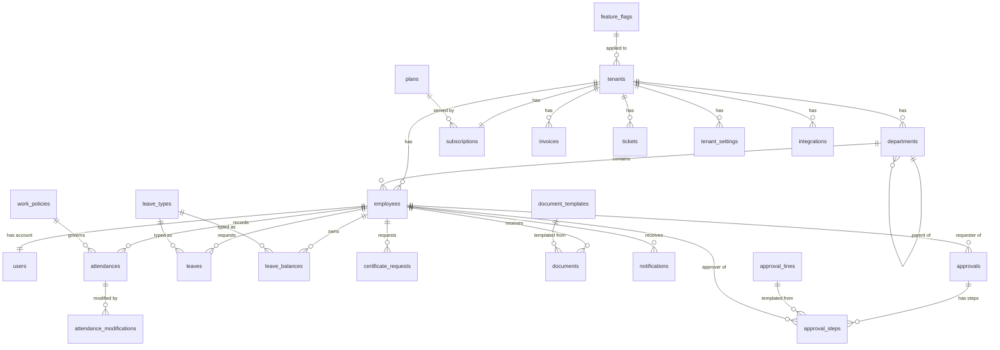

# 04. 데이터 모델

> 본 문서는 PRD 차원의 **엔티티 개요 + 관계도**. 상세 ERD/RLS/마이그레이션은 Phase 3 산출물(`.flowset/db/`).
> 데이터 모델 SSOT는 `.flowset/spec/matrix.json` (entities 블록).

## 1. 엔티티 카탈로그 (16종)

### 운영사 도메인 (4종)
| 엔티티 | 한글명 | 용도 |
|--------|-------|------|
| `tenants` | 테넌트 | 고객사 마스터 |
| `tenant_admins` | 테넌트 관리자 매핑 | 운영사 ↔ 고객사 관리자 |
| `subscriptions` | 구독/요금제 | 테넌트별 구독 상태 |
| `invoices` | 청구서 | 월별 청구 / 세금계산서 / 수납 |
| `plans` | 요금제 | 플랜 마스터 (기본/프리미엄/커스텀) |
| `feature_flags` | 기능 플래그 | 글로벌/플랜/테넌트별 기능 ON/OFF |
| `tickets` | 지원 티켓 | 고객 문의 / 장애 / 요청 |

### 핵심 HR 도메인 (8종)
| 엔티티 | 한글명 | 용도 |
|--------|-------|------|
| `departments` | 부서 | 조직 트리 (self-ref) |
| `employees` | 직원 | 사번·고용형태·재직상태 |
| `users` | 사용자 | Supabase auth.users 확장 (employee_id 연결) |
| `roles` | 역할 권한 | 역할 마스터 + 권한 매핑 |
| `attendances` | 근태 | 출퇴근 기록 (1직원 × 1일) |
| `attendance_modifications` | 근태 수정 요청 | 직원의 출퇴근 수정 요청 |
| `leaves` | 휴가 | 휴가 신청 + 상태 |
| `leave_balances` | 휴가 잔여 | 직원별 휴가 유형별 부여/사용/잔여 |
| `leave_types` | 휴가 유형 | 연차/병가/경조사 등 테넌트별 정의 |
| `approvals` | 결재 | 결재 마스터 (휴가/근태/증명서/문서) |
| `approval_steps` | 결재 단계 | 결재선 (다단계) |
| `approval_lines` | 결재라인 템플릿 | 회사 설정에서 정의 |
| `documents` | 문서 | 급여명세서/계약서/증명서/인사문서 |
| `certificate_requests` | 증명서 요청 | 재직/경력 증명서 발급 요청 |
| `notifications` | 알림 | 인앱 알림 (Realtime broadcast) |
| `audit_logs` | 감사 로그 | 모든 C/U/D/A 이벤트 기록 |

### 회사 설정 도메인 (3종)
| 엔티티 | 한글명 | 용도 |
|--------|-------|------|
| `tenant_settings` | 회사 설정 | 근무정책/휴가정책/문서양식 마스터 |
| `work_policies` | 근무 정책 | 근무시간/근무제/지각기준 |
| `document_templates` | 문서 양식 | 계약서/증명서 템플릿 |

### 외부 연동 도메인 (1종)
| 엔티티 | 한글명 | 용도 |
|--------|-------|------|
| `integrations` | 외부 연동 | 카카오 알림톡 / SMS / Slack / SSO 등 연결 정보 |

## 2. 핵심 관계 (Mermaid)



## 3. 권한 매트릭스 매핑 (spec §9 + matrix.json)

각 엔티티는 `matrix.json.entities[엔티티명].permissions`에 역할별 C/R/U/D를 명시.

| 엔티티 | operator_super | tenant_super | tenant_hr_admin | tenant_manager | employee |
|--------|:--------------:|:------------:|:---------------:|:--------------:|:--------:|
| tenants | CRUD | R own | — | — | — |
| employees | R (감사) | CRUD all | CRU all | R team | R own |
| attendances | R (감사) | CRU all | CRU all | RU team | CRU own (요청만) |
| leaves | R (감사) | CRUA all | CRUA all | RA team | CR own + Cancel own |
| approvals | R (감사) | RA all | RA all | RA assigned | CR own + Cancel own |
| documents | R (감사) | CRUD all | CRU all | — | R assigned |

세부 매트릭스는 `matrix.json.entities[*].permissions` 참조. 본 표는 요약.

## 4. 멀티테넌트 격리 모델

### 4-1. tenant_id 컬럼 규칙

- **모든 도메인 테이블**에 `tenant_id uuid NOT NULL` 컬럼 필수
- **예외**: `tenants`, `plans`, `feature_flags`(글로벌), `audit_logs`(글로벌 검색 가능)
- 외래키: `tenant_id REFERENCES tenants(id) ON DELETE CASCADE` (`tenants` 외)

### 4-2. RLS 기본 정책 (모든 테이블 공통)

```sql
-- 모든 SELECT/INSERT/UPDATE/DELETE
CREATE POLICY tenant_isolation ON {table_name}
  USING (tenant_id = (auth.jwt() ->> 'tenant_id')::uuid)
  WITH CHECK (tenant_id = (auth.jwt() ->> 'tenant_id')::uuid);

-- 운영사 우회 (operator_super, operator_staff)
CREATE POLICY operator_override ON {table_name}
  USING (auth.jwt() ->> 'role' IN ('operator_super', 'operator_staff'));
```

상세 RLS는 Phase 3에서 엔티티별로 정밀화.

## 5. 인덱스 전략 (요약)

| 테이블 | 핵심 인덱스 |
|--------|----------|
| `attendances` | `(tenant_id, employee_id, work_date DESC)`, `(tenant_id, work_date)` |
| `leaves` | `(tenant_id, employee_id, start_date)`, `(tenant_id, status, requested_at DESC)` |
| `approvals` | `(tenant_id, status, requested_at DESC)`, `(tenant_id, requester_id)` |
| `approval_steps` | `(approval_id, step_order)`, `(approver_id, status) WHERE status = 'pending'` |
| `notifications` | `(user_id, read_status, created_at DESC)` |
| `audit_logs` | `(tenant_id, created_at DESC)`, `(target_type, target_id)` |
| `documents` | `(tenant_id, owner_id, created_at DESC)`, `(tenant_id, document_type)` |

상세 인덱스는 Phase 3 ERD에서.

## 6. 상태 머신 (Approval / Leave / Attendance)

### 6-1. Approval 상태 머신
```
draft → pending → in_progress → approved
                              → rejected
                              → cancelled (요청자)
```

### 6-2. Leave 상태 머신
```
draft → pending → approved → completed (휴가 사용 후)
              → rejected
              → cancelled (승인 전/후)
```

### 6-3. Attendance 상태 머신 (status 컬럼)
```
미출근 → 근무중 → 휴게중 → 근무중 → 퇴근
                                    → 누락 (퇴근 미기록 자동)
                                    → 수정요청중 → 수정완료
```

각 상태 전이는 Edge Function 또는 RPC로 검증.

## 7. matrix.json 채움 계획

Phase 1.5에서 다음 entities를 `matrix.json.entities`에 채움:

```
Tenant, Subscription, Invoice, Plan, FeatureFlag, Ticket,
Department, Employee, User, Role,
Attendance, AttendanceModification,
Leave, LeaveBalance, LeaveType,
Approval, ApprovalStep, ApprovalLine,
Document, CertificateRequest, DocumentTemplate,
Notification, AuditLog,
TenantSetting, WorkPolicy, Integration
```

각 엔티티의 필드는 본 PRD 요약 + Phase 3 ERD에서 상세화.

## 8. 변경 이력

| 일자 | 변경 | 사유 |
|------|------|------|
| 2026-05-15 | 초안 — 26 엔티티 카탈로그 + ER 다이어그램 | Phase 1 진입 |
